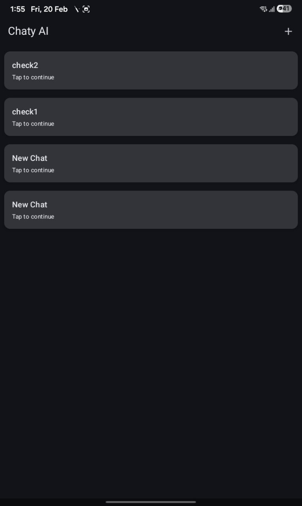
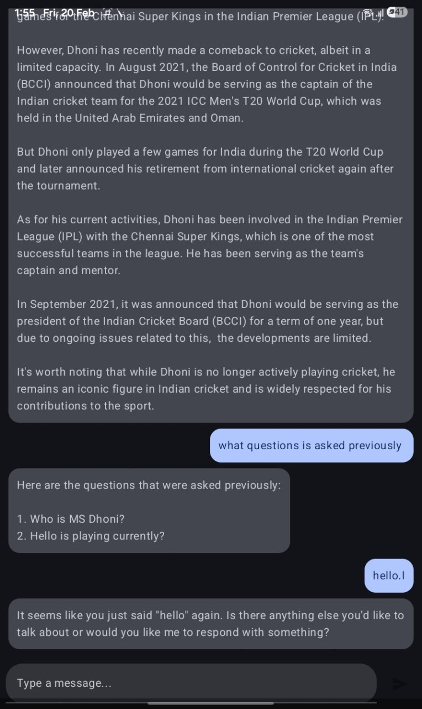

# 🤖 Chaty AI

A modern AI-powered chat application built using **Jetpack Compose, Room, Hilt, Retrofit, and Type-Safe Navigation**.

This app allows users to create multiple conversations, maintain chat history locally, and interact with an AI backend while preserving conversation context.

---

## 🚀 Features

- 🧠 Multi-conversation support
- 💬 Chat history stored locally using Room
- 🔄 Retrofit-based API integration
- 🧩 Type-safe navigation using Kotlin Serialization
- 🗂 Conversation list with custom titles
- ➕ Create new chat with title input dialog
- ⚡ Clean MVVM architecture
- 💉 Dependency Injection with Hilt
- 🎨 Modern UI using Material 3 & Jetpack Compose

---

## 🛠 Tech Stack

- **Kotlin**
- **Jetpack Compose**
- **Room Database**
- **Hilt (Dagger)**
- **Retrofit**
- **Kotlin Coroutines & Flow**
- **Navigation Compose (Type Safe)**

---

## 📱 Screens

### 1️⃣ Conversation List Screen

- Displays all conversations
- Create new conversation using dialog
- Navigate to chat screen

---

### 2️⃣ Chat Screen

- Displays full chat history
- Shows user & AI messages
- Typing indicator while waiting for response
- Maintains conversation context

---

## 🏗 Architecture

The app follows **MVVM Clean Architecture**:

UI (Compose)
↓  
ViewModel  
↓  
Repository  
↓  
Room + Retrofit  

- Local database stores all messages.
- Last 20 messages are sent to backend for context.
- Each conversation has unique UUID.

---

---

## 🔥 What Makes This Project Advanced?

- Uses **Flow + StateFlow** properly
- Avoids string-based navigation
- Maintains chat history per conversation
- Handles async network + database sync
- Production-style architecture

---

## 📌 Future Improvements

- Swipe to delete conversations
- Auto-generate conversation title from first message
- Pagination support
- Streaming AI responses
- Dark/Light theme toggle

---

## 👨‍💻 Author

**Siddhartha Bhatnagar**

Android Developer | ML & GenAI Enthusiast  
Part of “10 Advanced Android Projects” Series 🚀

---

⭐ If you like this project, consider giving it a star!
